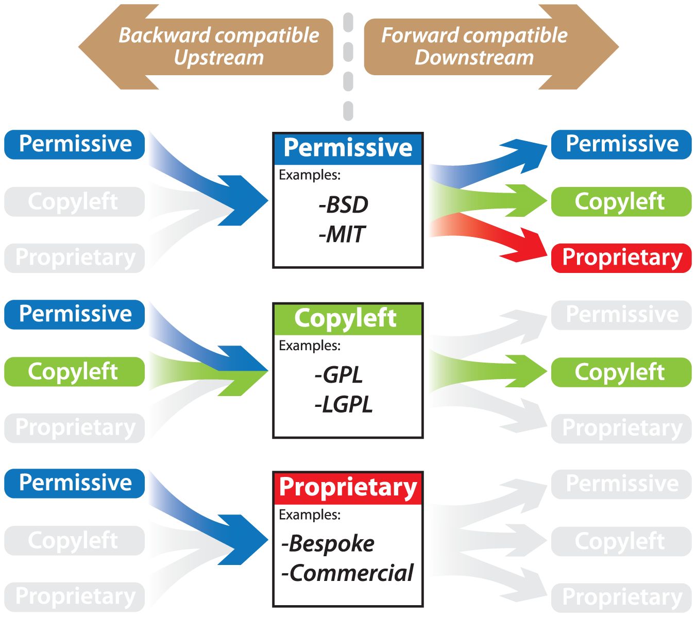

## Does copyright apply?

**Copyright applies to creative works**

* source code
* text (manuscripts etc)
* images

## Does copyright apply?

**Typically not copyrightable:**

* data, results
* individual records in a database of facts

**Depends on jurisdiction and case:**

* curated collections of data
* databases
* medical images

## Choose A License

<iframe width="70%" height="700px" src="http://choosealicense.com/"></iframe>

## Software licensing guide
<small>Figure 3: Schematic representation of license directionality.</small>
<small>Source: Morin, Andrew, Jennifer Urban, and Piotr Sliz. 2012. [A Quick Guide to Software Licensing for the Scientist-Programmer.](http://dx.doi.org/10.1371/journal.pcbi.1002598) PLoS Computational Biology 8 (7): e1002598 </small>

## Creative Commons

<iframe width="100%" height="700px" src="http://creativecommons.org/choose/"></iframe>

## Open is not open to interpretation

[The Open Definition](http://opendefinition.org/) sets out principles that
define “openness” in relation to data and content. It makes precise the meaning
of “open” in the terms _open data_, _open content_, and _open source_:

> <small>“Open means anyone can freely access, use, modify, and share for any purpose
(subject, at most, to requirements that preserve provenance and openness).” </small>

or more succinctly:

> <small>“Open data and content can be freely used, modified, and shared by anyone for
any purpose”</small>

## Waiving copyright

CC0 enables scientists, educators, artists and other creators and owners of
copyright- or database-protected content to waive those interests in their works
and thereby place them as completely as possible in the public domain, so that
others may freely build upon, enhance and reuse the works for any purposes
without restriction under copyright or database law.

## Dryad requires CC0

[Dryad’s use of CC0](http://datadryad.org/pages/faq#info-cc0) to make the terms
of reuse explicit has some important advantages:

* **Interoperability**: Since CC0 is both human and machine-readable, other people
nd indexing services will automatically be able to determine the terms of use.
* **Universality**: CC0 is a single mechanism that is both global and universal,
covering all data and all countries. It is also widely recognized.
* **Simplicity**: There is no need for humans to make, or respond to, individual
data requests, and no need for click-through agreements. This allows more
scientists to spend their time doing science.

## Licenses versus community norms

From the [Panton Principles](http://pantonprinciples.org/faq/#Q11_What_are_community_norms_and_why_are_they_important):

> <small>[...] in the scholarly research community the act of citation is a commonly
held community norm when reusing another community member’s work.
>
> Community norms can be a much more effective way of encouraging positive
behaviour, such as citation, than applying licenses. A well functioning
community supports its members in their application of norms, whereas licences
can only be enforced through court action and thus invite people to ignore them
when they are confident that this is unlikely.</small>

## Licenses are legal instruments

* Licenses, copyright, terms of use are complicated issues.
* There are legal implications to your choices.
* Citation is a professional norm in science.
    - We have good systems for ensuring proper citation.
    - Would you try to sue someone in court who fails to cite you properly?
* Keep it simple by putting the least-restrictive license possible

 
_Let scientists do science without having to talk to lawyers._
